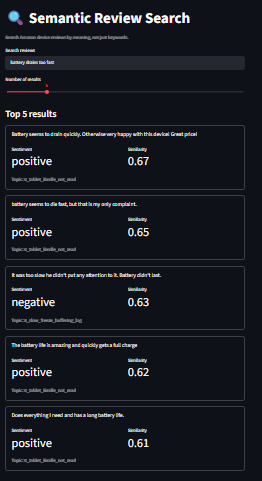

# NLP Insights from Amazon Product Reviews

I built this project to go beyond a simple "run sentiment analysis on some reviews" exercise — the goal was to actually dig into a real dataset and figure out *why* customers were unhappy, not just measure that they were.

## TL;DR

I analyzed ~34,600 reviews of Amazon devices (Kindle, Fire TV, Echo, Fire Tablet) and found that negative sentiment isn't spread evenly across the product experience — it's concentrated almost entirely in a handful of technical failure modes: streaming buffering, WiFi connectivity, and charging hardware. Everything else (the actual reading/listening/watching experience) skews heavily positive. I also found that one of the biggest pain points — buffering complaints — got noticeably better between 2016 and 2017.

## The dataset

~34,660 reviews spanning 2011–2018, across Amazon's device lineup. [Source](https://github.com/Arjun-Mota/amazon-product-reviews-sentiment-analysis) — it's not included in this repo since it's ~50MB, but the link above has it.

The first thing I noticed doing EDA: the ratings are heavily skewed, about 69% are 5-star. That imbalance ended up shaping a lot of decisions later on (how I bucketed sentiment classes, why I used class weighting when training).

## What's in the pipeline

**1. Preprocessing**
Standard cleaning with spaCy — lowercase, remove stopwords/punctuation, lemmatize. I almost shipped a bug here that's worth mentioning: my first pass stripped out negation words ("not", "no") as stopwords, which quietly flips the meaning of phrases like "not disappointed" into just "disappointed." Caught it by spot-checking a few cleaned reviews against the originals, and fixed it by explicitly keeping negation words in the pipeline.

**2. Sentiment analysis — two approaches, compared**
- A pretrained transformer (DistilBERT fine-tuned on SST-2) as a zero-effort baseline
- My own TF-IDF + Logistic Regression model, trained directly on this dataset's vocabulary

The pretrained model got ~88% agreement with rating-derived labels on a sample, but it stumbled on reviews that were clearly positive in *this* domain but used product-review language it hadn't seen much of (e.g., "streams," "subscriptions") — it's trained on movie reviews, so there's a domain mismatch. My custom model, trained with `class_weight='balanced'` to handle the imbalance, did better on catching negative/neutral reviews (recall of 58%/45%) but at a real cost to precision — a classic tradeoff, not a free win.

**3. Topic modeling — LDA vs. BERTopic**
I ran both and compared them honestly rather than picking one:
- **LDA**: I tested topic counts from 2–12 using coherence scoring, landed on k=4 as the mathematically optimal choice. It gave clean, broad categories — basically rediscovering the product lines (Echo, Kindle, Fire TV) plus one catch-all.
- **BERTopic**: its default clustering found 274 topics, way too fragmented to be useful (many with fewer than 50 supporting reviews). I reduced this down in two passes — first tried 20, which merged too aggressively and created one giant 40%-of-the-dataset catch-all topic, so I backed off to 35, which struck a much better balance between granularity and readability.

BERTopic's extra granularity is what actually made the insight-finding possible — it surfaced specific themes like buffering/freezing, WiFi issues, and charging problems that LDA's broader categories missed entirely.

**4. Tying sentiment and topics together**
This is where the actual finding came from. I cross-referenced sentiment scores against BERTopic's themes and found negative sentiment concentrated almost entirely in a small set of technical-failure topics — some running 4-6x above the dataset's overall negative rate — while topics about the core product experience stayed well below baseline.

## The main finding, spelled out

| Topic | % Negative | vs. baseline (2.4%) |
|---|---|---|
| Buffering / freezing / lag | 14.0% | ~5.8x |
| WiFi / connectivity | 11.0% | ~4.6x |
| Ads / interruptions | 10.9% | ~4.5x |
| Charging / port issues | 10.6% | ~4.4x |

Meanwhile, topics like reading experience, portability, and kids' use all sat at 0.5–1.5% negative — well below the dataset average.

I also checked whether the buffering complaints were trending in any direction over time, and they were: negative sentiment on that topic dropped from 15.8% (2016, n=266) to 10.5% (2017, n=181). There's an earlier 2015 data point too, but the sample size there (n=45) is thin enough that I don't fully trust the number.

## Tech stack

Python, pandas, spaCy, Hugging Face Transformers, scikit-learn, gensim, BERTopic, matplotlib/seaborn, pyLDAvis

## What I'd do differently / limitations

- Star rating is an imperfect proxy for sentiment — I found several "positive" reviews (by rating) that contained genuinely mixed or complaint-heavy language
- The topic count for BERTopic (35) was a judgment call, not a hard optimum — I picked it after watching how a too-low count (20) collapsed distinct themes together
- Only 3 years of reliable time-trend data, and one of those years has a small sample

## Repo structure
```
├── notebooks/     → the full pipeline, notebook form
├── outputs/       → saved visualizations (LDA topic map, etc.)
└── README.md
```
## Semantic Search (Added Feature)

Extended the project with a semantic search layer on top of the cleaned review dataset, 
enabling search by *meaning* rather than exact keyword matches.

**Stack:** `sentence-transformers` (all-MiniLM-L6-v2) for embeddings, FAISS (`IndexFlatIP`, 
cosine similarity) for nearest-neighbor search, Streamlit for the interactive UI.

**How it works:** Each of the ~34,600 cleaned reviews is embedded into a 384-dimensional 
vector. At query time, the search string is embedded the same way, and FAISS returns the 
most similar reviews by cosine similarity — surfacing relevant results even when the query 
shares no words with the matched review.

### Example queries

| Query | Top match | Similarity |
|---|---|---|
| "screen freezes and stops responding" | *"Freeze frequently... No way to trouble shoot or repair it..."* | 0.61 |
| "battery drains too fast" | *"Battery seems to drain quickly. Otherwise very happy with this device!"* | 0.67 |
| "good tablet for young children" | *"Great simple tablet for younger children to use..."* | 0.90 |
| "arrived broken right out of the box" | *"Item arrived as described. No damages and fast shipping."* (mismatch — see note) | 0.51 |

**A note on limitations:** the last query shows semantic search isn't infallible — it 
partially latched onto "box" as a product term (Fire TV Stick reviews) rather than the 
"arrived damaged" intent, and the genuinely relevant review only ranked 3rd. Compound 
queries mixing multiple concepts (condition + packaging + a term that's also a product 
name in the corpus) can confuse the embedding.

### Running the app
\`\`\`bash
streamlit run app.py
\`\`\`

